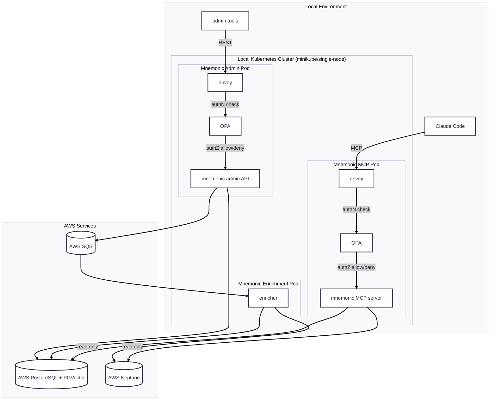

# MVP 4

MVP 4 introduces local Kubernetes deployment and explicit authentication/authorization controls.

1. Deploy Mnemonic services locally on a single-node Kubernetes cluster (for example, minikube).
2. Add Envoy configuration as the ingress/authN layer for MCP and Admin API traffic.
3. Add OPA policies as the authZ checkpoint before requests reach service handlers.
4. Begin Helm charts for repeatable local cluster deployment.
5. Keep data and queue infrastructure on managed AWS services.

