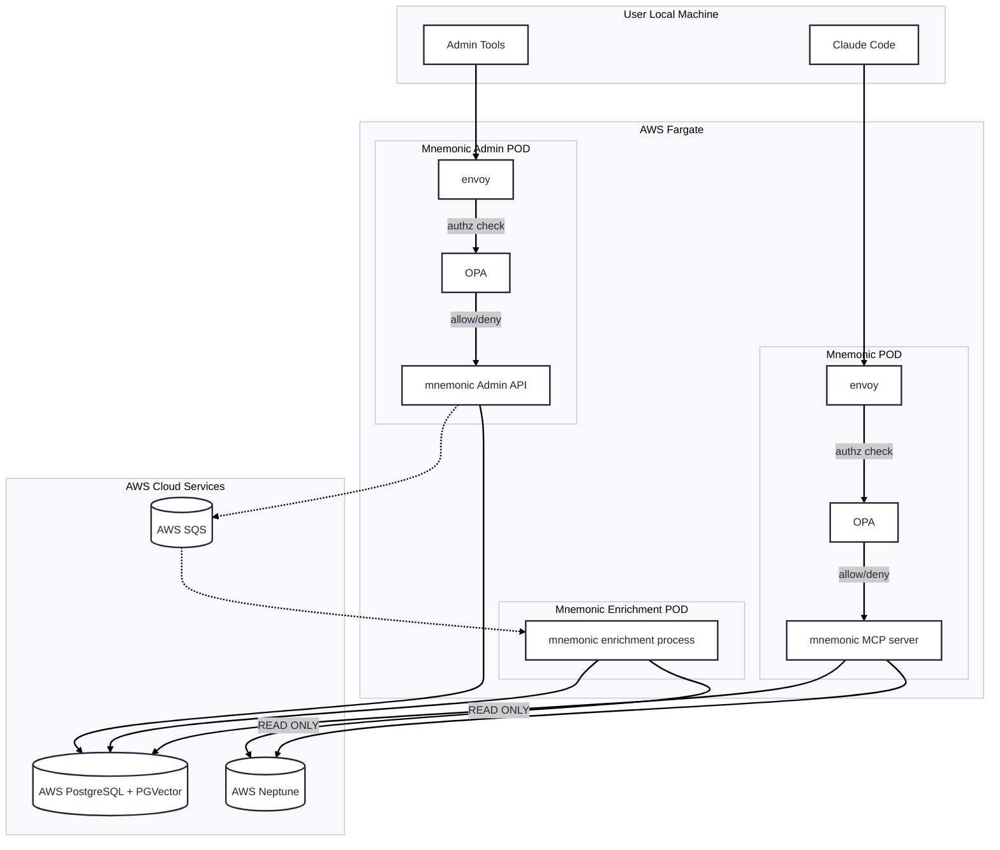

# MVP 5

Iteration 5 is the cloud end state for runtime deployment and infrastructure automation:

1. Move Mnemonic runtime from local Kubernetes to AWS-hosted compute (as shown: AWS Fargate pods/services).
2. Keep Envoy and OPA in the request path for MCP and Admin API authorization controls.
3. Provision and manage AWS networking, compute, and managed services with Terraform.
4. Use AWS configuration management patterns (for example, SSM Parameter Store and Secrets Manager) for runtime config and secrets.

Converted from `_ideas/mnemonic-concept-cloud-deployment.drawio`.

