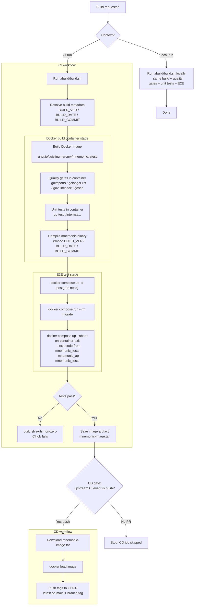

# Build Pipeline Diagram

This diagram shows how `src/mnemonic/build/build.sh` drives both local builds and CI builds.
For a reusable org-level reference example, see [Docker-First CI/CD Reference Example](../../_draft-skills/docker-first-ci-cd-implementation/references/docker-first-ci-cd-diagram.md).

