# POST /v1/api/patterns — Activity Diagram

```mermaid
flowchart TD
    A([HTTP POST /v1/api/patterns]) --> B[Handler: Create]

    B --> C[ShouldBindJSON into patternCreateRequest]
    C --> D{JSON parse\nerror?}
    D -- yes --> E[RespondValidationError\n400 Bad Request]
    D -- no --> F[validatePatternFields]
    F --> G{any field\nerrors?}
    G -- yes --> G1[RespondValidationError\n400 Bad Request]
    G -- no --> H[validateAssociationRelevance\nagent_associations]

    H --> I{any relevance\noutside 0.0-1.0?}
    I -- yes --> I1[RespondValidationError\n400 Bad Request]
    I -- no --> J[Prepare inputs:\nnormalise nil slices,\ndefault zero relevance → 1.0]
    J --> AA[patternSvc.Create]

    subgraph SVC [Service: pattern.Create]
        AA --> AB[resolveAgentAssociations:\nfor each agent_name → agentRepo.Get]
        AB --> AC{referenced agent\nmissing?}
        AC -- yes --> AC1[return service.ErrNotFound]
        AC -- no --> AD{lookup error?}
        AD -- yes --> AD1[return wrapped error]
        AD -- no --> AE[build patternrepo.Pattern struct]

        AE --> AF[patternRepo.Create]

        subgraph REPO [Repository: pgxRepository.Create]
            AF --> AG[prepare record for insert:\nserialise JSON,\nassign ID and timestamps]
            AG --> AH["INSERT INTO patterns\nenrichment_status='pending'"]
            AH --> AI{DB error?}
            AI -- unique violation\npg code 23505 --> AI1[return ErrNameExists]
            AI -- other error --> AI2[return wrapped error]
            AI -- success --> AJ[return create result]
            AI1 --> AJ
            AI2 --> AJ
        end

        AJ --> AK{create error?}
        AK -- ErrNameExists --> AK1[return service.ErrConflict]
        AK -- other error --> AK2[return wrapped error]
        AK -- nil --> AP{len resolvedAssocs > 0?}

        AP -- yes --> AQ[patternRepo.SetAgentAssociations]
        AQ --> AR{error?}
        AR -- yes --> AR1[return wrapped error]
        AR -- no --> AS
        AP -- no --> AS

        AS{chunkRepo\nnon-nil?}
        AS -- yes --> AT[create chunks and schedule\nper-chunk enrichment]
        AT --> AU{error?}
        AU -- yes --> AU1[return wrapped error]
        AU -- no --> AZ

        AS -- no --> AX[create pattern-level\nenrichment job]
        AX --> AY{error?}
        AY -- yes --> AY1[return wrapped error]
        AY -- no --> AZ

        AZ{len graphAssocs > 0?}
        AZ -- yes --> BA[syncNeo4j best-effort]
        AZ -- no --> BB
        BA --> BB[return pattern, nil]
    end

    BB --> BC{svc.Create error?}
    BC -- service.ErrConflict --> BC1[409 Conflict]
    BC -- service.ErrNotFound --> BC2[404 Not Found\nreferenced agent missing]
    BC -- other error --> BC3[500 Internal Server Error]
    BC -- nil --> BD[GetAgentAssociations + ResolveAgentNames]

    BD --> BE{error?}
    BE -- yes --> BE1[500 Internal Server Error]
    BE -- no --> BI[toPatternResponse]

    BI --> BJ[Set Location header]
    BJ --> BK([202 Accepted + patternResponse body])
```

## Notes

- `validatePatternFields` checks required fields, length limits, and identifier format rules. Current limits are: `name` required, max 128 runes, kebab-case; `content` required, max 100000 bytes; `description` max 500 runes; `tags` max 20 items; `entity_type` required, max 100 runes, kebab-case; `language` required, max 64 bytes, kebab-case; `domain` required, max 64 bytes, kebab-case.
- `validateAssociationRelevance` rejects any `agent_associations[*].relevance` outside `0.0-1.0`.
- `Prepare inputs` normalises nil slices and defaults zero association relevance values to `1.0` before calling the service.
- `language` and `domain` are currently validated for **format only** (kebab-case, max 64 bytes). No allowed-values check is performed — any well-formed identifier is accepted.
- The vocabulary check (allowed languages and domains loaded from config) is planned but not yet implemented.
- `enrichment_status` is always set to `pending` on insert; enrichment happens asynchronously.
- Neo4j graph sync (`syncNeo4j`) is best-effort — failures are logged but do not fail the request.
- Per-chunk enrichment jobs are created only when `chunkRepo` is non-nil (i.e., chunking is enabled in config).
