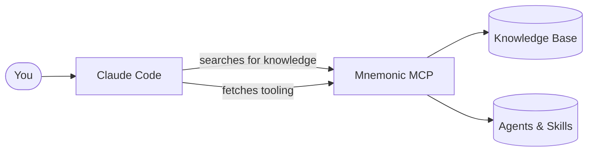
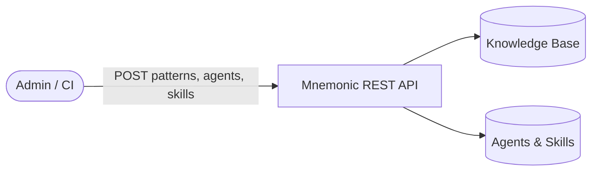

# What Is Mnemonic?

[Back to Architecture Overview](architecture/README.md) |
[Back to Project README](../README.md)

## The problem it solves

When a team adopts Claude Code, something quietly goes wrong. Each person builds up their own
agents and skills, discovers their own tricks, and figures out their own workflows. Over time,
the team is running a dozen slightly different setups. New people start from scratch. Useful
patterns live in one person's head or one person's config.

Mnemonic exists to fix that. It gives the whole team a shared place to store knowledge and a
single source of truth for tooling.

## What Mnemonic actually is

Mnemonic is a service — a small server you run for your team. It holds two things:

**A shared knowledge base.** Your team curates a collection of patterns: coding conventions,
architectural decisions, how we do things around here. When Claude Code needs context about
your team's approach to something, it can ask Mnemonic and get a real answer instead of
guessing.

**A tooling library.** Agents, skills, and commands are stored in Mnemonic and synced down to
every developer's machine. Everyone runs the same versions. When the team improves a skill,
everyone gets the update on their next sync.

That is the whole idea. Shared memory, consistent tools.

## The user is still in charge

Mnemonic does not route requests, make decisions, or orchestrate workflows. That is the user's
job — and deliberately so. You know your work better than any routing engine does.

Think of Mnemonic as a well-organized shelf. It holds things your team has agreed are valuable.
Claude Code can reach for them when it needs them. But Claude Code does not do that on its own —
you ask it to, or you set up a skill that does.

## How Claude Code talks to Mnemonic

Claude Code connects to Mnemonic using MCP (Model Context Protocol). MCP is the native way
Claude Code talks to external services — no extra CLI, no scripts, no glue code needed.

Once Mnemonic is configured as an MCP server, Claude Code can call it directly during a
conversation. It can search the knowledge base, pull up a pattern, ask what agents are available,
or fetch the full definition of a skill.

All MCP access is read-only. Claude Code can look things up, but it cannot write to Mnemonic.
That keeps things predictable.

## How knowledge gets in

Someone on the team — an admin, a CI pipeline, a script — pushes content into Mnemonic through
a REST API. That is the write path. You POST a pattern, Mnemonic stores it, generates a
semantic embedding in the background, and it becomes searchable within a few moments.

The same API handles tooling: upload an agent definition, register a skill, publish a command.
Mnemonic becomes the canonical source.

## How tooling stays in sync

Every developer runs a sync command periodically — `/mnemonic-sync` as a Claude Code skill. It
checks what has changed on the server and downloads only the things that are new or updated.
Agents land in `~/.claude/agents/`. Skills land in `~/.claude/skills/`. Commands land in
`~/.claude/commands/`.

After a sync, you are running the same tooling as everyone else on the team.

The sync is incremental. If only one collection changed, only that collection is fetched. It
is fast regardless of how much total content Mnemonic holds.

## What lives where

| What | Where it lives | Who owns it |
| --- | --- | --- |
| Patterns (team knowledge) | Mnemonic | Your team, via the REST API |
| Agent definitions | Mnemonic | Your team, via the REST API |
| Skill definitions | Mnemonic | Your team, via the REST API |
| Command definitions | Mnemonic | Your team, via the REST API |
| Local copies of tooling | `~/.claude/` on each machine | Synced from Mnemonic |
| Workflow decisions | You | Always |
| AI inference | Claude Code / Anthropic | Mnemonic never does inference |

---

The architecture docs go deeper on each of these pieces. Start with the
[System Architecture](architecture/02-system-architecture.md) if you want to understand how
Mnemonic is built, or the [Communication Patterns](architecture/03-communication-patterns.md)
if you want to understand the MCP and REST surfaces in detail.
