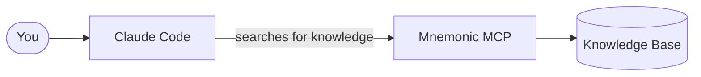

# What Is Mnemonic?

[Back to Architecture Overview](architecture/README.md) |
[Back to Project README](../README.md)

## The problem it solves

When a team adopts Claude Code, something quietly goes wrong. Each person builds up their own
agents and skills, discovers their own tricks, and figures out their own workflows. Over time,
the team is running a dozen slightly different setups. New people start from scratch. Useful
patterns live in one person's head or one person's config.

Mnemonic exists to fix that. It gives the whole team a shared place to store knowledge and a
single source of truth for tooling.

## What Mnemonic actually is

Mnemonic is a service — a small server you run for your team. It holds two things:

**A shared knowledge base.** Your team curates a collection of patterns: coding conventions,
architectural decisions, how we do things around here. When Claude Code needs context about
your team's approach to something, it can ask Mnemonic and get a real answer instead of
guessing.

**A tooling library.** Agents and skills are stored in Mnemonic and synced down to
every developer's machine. Everyone runs the same versions. When the team improves a skill,
everyone gets the update on their next sync.

That is the whole idea. Shared memory, consistent tools.

## The user is still in charge

Mnemonic does not route requests, make decisions, or orchestrate workflows. That is the user's
job — and deliberately so. You know your work better than any routing engine does.

Think of Mnemonic as a well-organized shelf. It holds things your team has agreed are valuable.
Claude Code can reach for them when it needs them. But Claude Code does not do that on its own —
you ask it to, or you set up a skill that does.

## How Claude Code talks to Mnemonic

Claude Code connects to Mnemonic using MCP (Model Context Protocol). MCP is the native way
Claude Code talks to external services — no extra CLI, no scripts, no glue code needed.

Once Mnemonic is configured as an MCP server, Claude Code can call it directly during a
conversation. It can search the knowledge base for patterns, find related patterns, or pull up a
specific pattern by ID. These three pattern search operations are the full MCP tool surface.

All MCP access is read-only. Claude Code can look things up, but it cannot write to Mnemonic.
That keeps things predictable.



## How knowledge gets in

Someone on the team — an admin, a CI pipeline, a script — pushes content into Mnemonic through
a REST API. That is the write path. You POST a pattern, Mnemonic stores it, generates a
semantic embedding in the background, and it becomes searchable within a few moments.

The same API handles tooling: upload an agent definition, register a skill.
Mnemonic becomes the canonical source.


## Embeddings explained

When Mnemonic stores a pattern, it generates a semantic embedding in the background. That embedding is what makes search work. Here is what that means in practice.

### What is an embedding?

An embedding is a numeric representation of text that captures its semantic meaning. Think of it as a "fingerprint" that represents the concept and context of the content.

- Generated by OpenAI's text-embedding-3-large model
- 2000 floating-point numbers per embedding
- Each dimension captures different aspects of meaning
- Similar concepts produce similar vector patterns

### Why 1536 dimensions?

It's not a magic number. That's just what OpenAI's text-embedding-3-large model outputs. Different embedding models have different dimensions:

- OpenAI text-embedding-3-small: 1536
- OpenAI text-embedding-3-large: 2000
- Cohere embed-english-v3.0: 1024
- Sentence Transformers all-MiniLM-L6-v2: 384

The 2000 dimension size is a sweet spot balancing quality, cost, and performance for our use case.

### How similarity works: the arrow analogy

Think of embeddings like arrows pointing in a direction. Each arrow has 2000 components, but conceptually it's pointing somewhere in meaning-space.

When two pieces of text have similar meanings, their embeddings are like arrows pointing in roughly the same direction. When texts are unrelated, their arrows point in very different directions.

Cosine similarity measures the angle between these arrows:

- Small angle = Arrows point the same way = High similarity
- Large angle = Arrows point different directions = Low similarity

**Similarity scores:**

- 1.0 = Identical direction (same meaning)
- 0.7-1.0 = Small angle (highly relevant, typical threshold for pattern matching)
- 0.5-0.7 = Medium angle (somewhat related)
- 0.0-0.5 = Large angle (unrelated or opposite meaning)

**Example:**

```text
Query: "Help me optimize this SQL query"
Embedding: [0.023, -0.145, 0.087, ..., 0.034] (1536 values)

Pattern 1: "Database query optimization techniques"
Embedding: [0.025, -0.142, 0.091, ..., 0.036] (1536 values)
Similarity: 0.94 (arrows pointing nearly the same direction)

Pattern 2: "Go error handling best practices"
Embedding: [-0.081, 0.234, -0.052, ..., -0.123] (1536 values)
Similarity: 0.31 (arrows pointing in different directions)
```

### Who calculates what?

- **OpenAI API**: Generates the embedding (turns text into 1536 numbers)
- **PGVector**: Stores the embedding and calculates similarity using the `<=>` operator
- **Mnemonic**: Orchestrates everything (calls APIs, queries databases, assembles responses)

Mnemonic never touches vector arithmetic directly. It just asks PGVector "which patterns are similar to this embedding?" and PGVector does the math.

### How IVFFlat indexes speed things up

When you have thousands of patterns, comparing against every single one is slow. That's where IVFFlat indexes come in.

IVFFlat uses k-means clustering to create "buckets" of similar patterns. Think of it like organizing a library into sections. When someone asks for a book about SQL, you don't search the entire library. You go to the database section first, then search there.

During index creation, k-means finds "centroids" (bucket centers) and each pattern gets assigned to its nearest centroid. At query time, Mnemonic compares the query embedding to centroids first, then searches only the nearest buckets — skipping distant ones that won't be relevant.

The default configuration searches roughly 10% of patterns per query, which dramatically improves performance while maintaining accuracy. The key insight is that relevant patterns cluster together in embedding space, so searching nearby buckets catches what we need.

## How tooling stays in sync

Every developer runs a sync command periodically — `/mnemonic-sync` as a Claude Code skill. It
checks what has changed on the server and downloads only the things that are new or updated.
Agents land in `~/.claude/agents/`. Skills land in `~/.claude/skills/`.

After a sync, you are running the same tooling as everyone else on the team.

The sync is incremental. If only one collection changed, only that collection is fetched. It
is fast regardless of how much total content Mnemonic holds.

## What lives where

| What | Where it lives | Who owns it |
| --- | --- | --- |
| Patterns (team knowledge) | Mnemonic | Your team, via the REST API |
| Agent definitions | Mnemonic | Your team, via the REST API |
| Skill definitions | Mnemonic | Your team, via the REST API |
| Local copies of tooling | `~/.claude/` on each machine | Synced from Mnemonic |
| Workflow decisions | You | Always |
| AI inference | Claude Code / Anthropic | Mnemonic never does inference |

---

The architecture docs go deeper on each of these pieces. Start with the
[System Architecture](architecture/02-system-architecture.md) if you want to understand how
Mnemonic is built, or the [Communication Patterns](architecture/03-communication-patterns.md)
if you want to understand the MCP and REST surfaces in detail.
