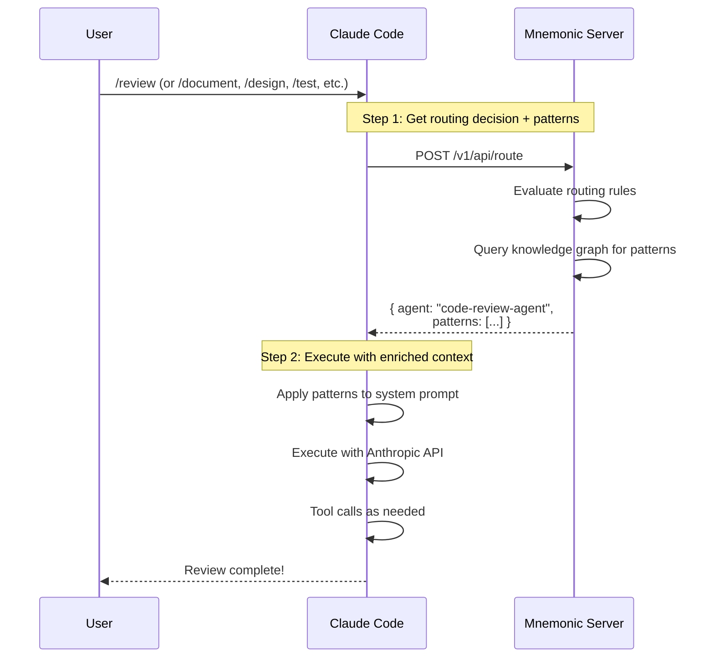
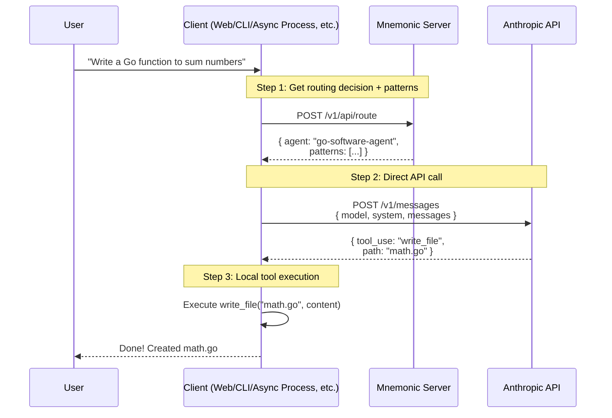

# Mnemonic Client Integration Concept

[Back to Architecture Overview](architecture/00-overview.md) |
[Back to Project README](../README.md)

## Unified Architecture: Mnemonic as the Backend

In this model, Mnemonic serves as the single backend service providing routing,
pattern retrieval, and agent management capabilities. Client applications
orchestrate calls to Mnemonic and AI services like Claude Code or the
Anthropic API directly.

> **What is a "Client"?** Any application that consumes Mnemonic's API: a CLI
> tool (like ACE CLI), a web application, an IDE extension, an automated
> business process, or a custom integration script.

### Phase 1: Claude Code Custom Commands

In Phase 1, Claude Code is the client. Users invoke custom commands (skills) like
`/review`, `/document`, `/design`, `/test`, etc. These commands query Mnemonic
for routing and patterns, then execute with enriched context.

### Phase 2: Other Clients (Web Apps, CLI Tools, etc.)

Other clients (web applications, the ACE CLI, business processes) can integrate
with Mnemonic and call the Anthropic API directly for custom workflows.

## Mnemonic API Endpoints

### Client Integration Endpoints

| Endpoint                         | Purpose                                |
| -------------------------------- | -------------------------------------- |
| `POST /v1/api/route`             | Determine which agent handles a prompt |
| `GET /v1/api/patterns`           | Retrieve patterns for agent + context  |
| `GET /v1/api/agents`             | List available agents and capabilities |
| `PUT /v1/api/routing-rules/{id}` | Update routing rules (admin)           |

## What Lives Where

| Component                 | Location            | Responsibility                   |
| ------------------------- | ------------------- | -------------------------------- |
| **Routing rules**         | Mnemonic            | Queryable knowledge storage      |
| **Patterns**              | Mnemonic            | Knowledge graph storage          |
| **Agent definitions**     | Mnemonic            | Structured data storage          |
| **Routing logic**         | Mnemonic            | Code-based evaluation            |
| **Prompt assembly**       | Client              | Combines route, patterns, prompt |
| **AI service invocation** | Client              | Builds and executes commands     |
| **Tool execution**        | Client / AI Service | Local filesystem operations      |

## Benefits of This Model

1. **Single backend**: Only Mnemonic to deploy and manage
2. **Lightweight clients**: Just orchestration, no server logic required
3. **Clean separation**: Knowledge storage (Mnemonic) vs orchestration
4. **Routing as data**: Rules stored alongside patterns, version controlled
5. **Flexible integration**: Clients can use Claude Code or Anthropic API
6. **Reusable patterns**: Multiple clients share the same knowledge base
