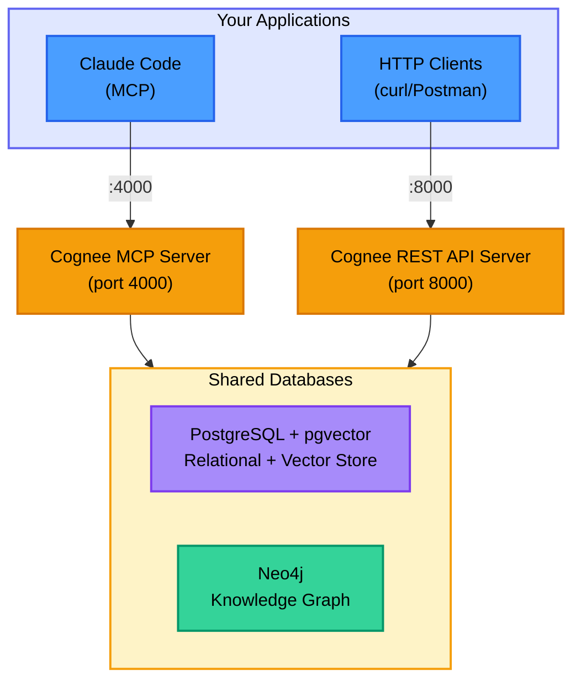

# Legacy TAS (Team Agentic Setup)

> This directory contains the things you need to use Cognee as a local memory store. It's useful for testing out agent definitions and patterns. This, in essense it basically the old TAS system. The rest of this document is basically the readme for the old setup. So if you just want to use the agents and patterns being developed, this will let you do that.

- **Cognee MCP Server** - For Claude Code integration via MCP protocol (port 4000)
- **Cognee REST API** - For HTTP/REST API access from any application (port 8000)
- **PostgreSQL with pgvector** - Relational database and vector storage
- **Neo4j** - Knowledge graph database

## Prerequisites

Before running the Legacy TAS setup, ensure you have the following tools and resources available.

### Required Tools

- **Docker 27+** - Container runtime for running Cognee services and databases. [Installation instructions](https://docs.docker.com/engine/install/)
- **Docker Compose 2.32+** - Container orchestration tool. [Installation instructions](https://docs.docker.com/compose/install/)
- **Bash 4.x** - Shell interpreter required for MAPFILE support used in the installation scripts
- **curl** - Command-line tool for HTTP requests, used by scripts to check health endpoints and call APIs
- **yq** - YAML processor used by validation scripts to parse YAML frontmatter. [Installation instructions](https://github.com/mikefarah/yq#install)
- **jq** - JSON processor used by validation scripts. [Installation instructions](https://jqlang.github.io/jq/download/)

### Required Environment

- **OPENAI_COGNEE_API_KEY** - OpenAI API key required for Cognee to generate embeddings and process data into knowledge graphs. Set this environment variable before running the installation:

  ```bash
  export OPENAI_COGNEE_API_KEY=your-api-key-here
  ```

### System Requirements

- **Memory** - 8-12GB RAM recommended (Cognee services are memory-intensive)
- **Available Ports** - The following ports must be available on your system:
  - `4000` - Cognee MCP Server
  - `5432` - PostgreSQL
  - `7474` - Neo4j Browser
  - `7687` - Neo4j Bolt protocol
  - `8000` - Cognee REST API

## Architecture

The deployment runs separate MCP and REST API servers that share common database backends (`docker-compose.yaml`).



**Note:** Both servers share the same database backends. Data added through one interface is immediately available through the other.

## Quick Start

### 1. Set API Key

Set the OpenAI API key environment variable:

```bash
export OPENAI_COGNEE_API_KEY=your-api-key-here
```

This is required for Cognee to process data into knowledge graphs.

### 2. Run Installation

> ⚠️ NOTE: THIS PROCESS WILL TAKE A GOOD 10 ~ 15 MINUTES DEPENDING ON YOUR MACHINE

```bash
cd /Users/doublej/dev/ace/legacy-tas
./install.sh
```

This orchestrates the complete setup:

1. Starts Docker containers (Cognee MCP, API, PostgreSQL, Neo4j)
2. Installs agent definitions to `~/.claude/agents/`
3. Installs global agent rules to `~/.claude/CLAUDE.md`
4. Validates pattern metadata
5. Loads patterns into Cognee datasets (one dataset per subdirectory)
6. Enriches patterns with knowledge graph relationships

All logs are written to `scripts/logs/{TIMESTAMP}/` with one log file per script.

### 3. Verify Services

```bash
docker compose ps
```

All services should show as "healthy".

### 4. Teardown

When finished, stop and remove services:

```bash
# Full reset - removes containers and volumes (deletes all data)
docker compose down -v

# Preserve data - removes containers only (keeps volumes)
docker compose down
```

### 5. Connect to Cognee

#### Option A: Claude Code (MCP)

From your development machine:

```bash
claude mcp add --scope user --transport sse cognee http://YOUR_SERVER_IP:4000/sse
```

Verify connection:

```bash
claude mcp list
```

#### Option B: REST API

The REST API is available at `http://localhost:8000`

**API Documentation:** <http://localhost:8000/docs> (Swagger UI)

**Example API calls:**

```bash
# Health check
curl http://localhost:8000/health

# Add data
curl -X POST http://localhost:8000/api/v1/add \
  -H "Content-Type: application/json" \
  -d '{"data": "Your text or file path here"}'

# Search
curl -X POST http://localhost:8000/api/v1/search \
  -H "Content-Type: application/json" \
  -d '{"query_text": "your search query"}'
```

## Manual Setup (Advanced)

For users who want to run setup steps individually, the `install.sh` script orchestrates these numbered scripts in order:

### 00-start-memory-infra.sh

Starts all Docker Compose services.

```bash
./scripts/00-start-memory-infra.sh
```

This script:

- Validates the `OPENAI_COGNEE_API_KEY` environment variable is set
- Starts all Docker Compose services
- Waits for all services to become healthy
- Validates health endpoints
- Logs output to `scripts/logs/{TIMESTAMP}/00-start-memory-infra.log`

### 01-install-agents.sh

Installs agent definitions to `~/.claude/agents/`.

```bash
./scripts/01-install-agents.sh
```

Logs to `scripts/logs/{TIMESTAMP}/01-install-agents.log`

### 02-install-global-agent-rules.sh

Installs global agent rules to `~/.claude/CLAUDE.md`.

```bash
./scripts/02-install-global-agent-rules.sh
```

Logs to `scripts/logs/{TIMESTAMP}/02-install-global-agent-rules.log`

### 03-validate-metadata.sh

Validates pattern metadata before loading.

```bash
./scripts/03-validate-metadata.sh
```

Logs to `scripts/logs/{TIMESTAMP}/03-validate-metadata.log`

### 04-load-patterns.sh

Loads patterns into Cognee datasets (one dataset per subdirectory).

```bash
./scripts/04-load-patterns.sh
```

Logs to `scripts/logs/{TIMESTAMP}/04-load-patterns.log`

### 05-enrich-patterns.sh

Enriches patterns with knowledge graph relationships.

```bash
./scripts/05-enrich-patterns.sh
```

Logs to `scripts/logs/{TIMESTAMP}/05-enrich-patterns.log`

## Service Endpoints

| Service               | Endpoint                       | Purpose                                    |
| --------------------- | ------------------------------ | ------------------------------------------ |
| **Cognee MCP**        | `http://localhost:4000/sse`    | MCP Server (SSE transport) for Claude Code |
| **Cognee REST API**   | `http://localhost:8000`        | REST API for HTTP clients                  |
| **API Documentation** | `http://localhost:8000/docs`   | OpenAPI/Swagger UI                         |
| **Health Check**      | `http://localhost:8000/health` | Service health status                      |
| Neo4j Browser         | `http://localhost:7474`        | Graph database UI                          |
| Neo4j Bolt            | `bolt://localhost:7687`        | Graph database protocol                    |
| PostgreSQL            | `localhost:5432`               | Relational database + pgvector             |

## Credentials

**Neo4j:**

- Username: `neo4j`
- Password: `cognee_neo4j_password`

**PostgreSQL:**

- Database: `cognee_db`
- Username: `cognee`
- Password: `cognee_password`

## Management Commands

```bash
# View MCP server logs
docker compose logs -f cognee-mcp

# View REST API server logs
docker compose logs -f cognee-api

# View all logs
docker compose logs -f

# Stop services
docker compose down

# Restart specific service
docker compose restart cognee-mcp
docker compose restart cognee-api

# Check service health
docker compose ps
```

## REST API Endpoints

The Cognee REST API provides comprehensive access to all Cognee functionality: [Full API Documentation](http://localhost:8000/docs)

## Data Persistence

All data is stored in Docker volumes:

- `postgres_data` - Relational data and vector embeddings (pgvector)
- `neo4j_data` - Knowledge graph
- `cognee_data` - Processed documents
- `cognee_system` - System metadata

## Reset Everything

To completely remove all data and start fresh:

```bash
docker compose down -v
```

This removes all volumes and data.

## Configuration

### LLM Configuration

Edit both `cognee-mcp` and `cognee-api` service environments in `docker-compose.yaml` with identical settings:

```yaml
# Required environment variables:
- LLM_API_KEY=your-api-key-here
- LLM_MODEL=gpt-4o # or gpt-4, claude-3-sonnet, etc.
- LLM_PROVIDER=openai # or anthropic, etc.
- EMBEDDING_PROVIDER=openai
- EMBEDDING_MODEL=text-embedding-3-small
- EMBEDDING_DIMENSIONS=1536 # 1536 for text-embedding-3-small, 3072 for 3-large
```

Both services must use the same LLM configuration to ensure consistent behavior across MCP and REST API interfaces.

## Troubleshooting

**Cognee server not starting:**

```bash
# Check MCP server logs
docker compose logs cognee-mcp

# Check REST API server logs
docker compose logs cognee-api
```

**Service shows as "unhealthy" but works:**

Some health checks may fail while the service is still functional. Verify by:

```bash
# Check MCP endpoint (exposed on port 4000)
curl http://localhost:4000/health

# Check REST API endpoint
curl http://localhost:8000/health
```

If the health endpoint returns a response, the service is working despite the health check status.

**Service won't start:**

```bash
# Check which service is failing
docker compose ps

# View specific service logs
docker compose logs cognee-mcp
docker compose logs cognee-api
docker compose logs postgres
docker compose logs neo4j
```

**Port already in use:**

If ports 4000 or 8000 are already in use:

```bash
# Check what's using the ports
lsof -i :4000
lsof -i :8000

# Stop conflicting services or edit docker-compose.yaml to use different ports
```

## Resource Usage

Approximate memory requirements:

- Cognee MCP Server: ~2-4GB
- Cognee REST API Server: ~2-4GB
- Neo4j: ~2-3GB
- PostgreSQL + pgvector: ~1GB

Total: ~7-12GB RAM recommended

## Network Access

To access from other machines on your LAN, ensure ports are accessible:

```bash
# Allow ports through firewall (example for ufw)
sudo ufw allow 4000/tcp  # Cognee MCP
sudo ufw allow 8000/tcp  # Cognee REST API
sudo ufw allow 7474/tcp  # Neo4j Browser (optional)
sudo ufw allow 5432/tcp  # PostgreSQL (optional)
```

Replace `localhost` with your server's LAN IP when connecting from other machines.

## Loading and Processing Patterns

The `install.sh` script automatically handles pattern loading and processing. This section documents the underlying workflow for reference.

### Pattern Loading Workflow

#### Step 1: Load patterns into dataset

```bash
cd /path/to/ace/legacy-tas
./scripts/04-load-patterns.sh
```

This script:

- Validates pattern metadata before loading
- Loads all `.md` files (except README.md) from `claude-agents/patterns/`
- Adds files to the `patterns` dataset via `/api/v1/add` endpoint
- Writes dataset name to `scripts/logs/datasets-loaded.txt`
- Logs to `scripts/logs/{TIMESTAMP}/04-load-patterns.log`

**Environment variables:**

- `COGNEE_URL` - Cognee API base URL (default: `http://localhost:8000`)
- `PATTERNS_DIR` - Pattern files directory (default: `${PROJ_ROOT}/claude-agents/patterns`)
- `DATASET_NAME` - Dataset name (default: `patterns`)

#### Step 2: Process into knowledge graph

Process specific datasets (from file):

```bash
cat scripts/logs/datasets-loaded.txt | ./scripts/05-enrich-patterns.sh
```

Process specific dataset (via echo):

```bash
echo "patterns" | ./scripts/05-enrich-patterns.sh
```

Process ALL datasets (no stdin):

```bash
./scripts/05-enrich-patterns.sh
```

This script:

- Accepts dataset names via stdin (piped or redirected)
- If NO stdin data, cognifies ALL datasets
- Calls `/api/v1/cognify` endpoint to build knowledge graphs
- Logs to `scripts/logs/{TIMESTAMP}/05-enrich-patterns.log`
- Processing runs asynchronously

**Important:** The `05-enrich-patterns.sh` script does NOT accept command-line arguments. Arguments like `./scripts/05-enrich-patterns.sh patterns` will show an error. Use stdin only.

**Environment variables:**

- `COGNEE_URL` - Cognee API base URL (default: `http://localhost:8000`)

#### Step 3: Monitor processing

Cognify operations run asynchronously. Monitor progress with:

```bash
docker compose logs -f cognee-api
```

### Complete Workflow Example

```bash
# Load patterns into Cognee dataset
./scripts/04-load-patterns.sh
# Output: Writes "patterns" to scripts/logs/datasets-loaded.txt

# Process into knowledge graph (choose one):
cat scripts/logs/datasets-loaded.txt | ./scripts/05-enrich-patterns.sh  # Process loaded datasets
./scripts/05-enrich-patterns.sh                                          # Process ALL datasets

# Monitor async processing
docker compose logs -f cognee-api
```

## CLI Tools

You can use the Cognee CLI directly within either container:

```bash
# Add data via CLI (using API container)
docker exec cognee_api python3 -m cognee add "Your text here"

# Search via CLI (using API container)
docker exec cognee_api python3 -m cognee search "search query" -t GRAPH_COMPLETION

# Process data (using API container)
docker exec cognee_api python3 -m cognee cognify

# View all CLI commands
docker exec cognee_api python3 -m cognee --help
```

**Note:** Use `cognee_api` for CLI operations since the API server provides the full REST API functionality.
